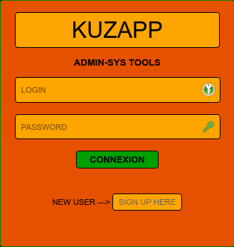

## KuzApp Version Beta - Linux System Administration Tools 

## Apache Docker Version





## System Maintenance Information and Diagnostic Script
The bash script provides an interface to execute a variety of sub-scripts that perform system cleaning, diagnostic, and network information tasks.

## Projet KuzApp

## Table des matières
- [Prérequis](#prérequis)
- [Création de l'image Docker](#création-de-limage-docker)
- [Création et exécution du conteneur](#création-et-exécution-du-conteneur)
- [Configuration de l'application](#configuration-de-lapplication)
- [Accès à l'application](#accès-à-lapplication)

## Prérequis

Avant de commencer, assurez-vous d'avoir installé les outils suivants :
- [Docker](https://www.docker.com/get-started)
- [Docker Compose](https://docs.docker.com/compose/install/) (si nécessaire)

## Création de l'image Docker

1. **Dockerfile** : Ce projet contient un `Dockerfile` qui définit l'image Docker. Les composants principaux installés dans l'image incluent :
   - **Debian** : Système d'exploitation de base.
   - **Apache** : Serveur web pour héberger l'application.
   - **PHP 8.2** : Langage de script pour le développement web.
   - **MariaDB** : Système de gestion de bases de données.
   - **OpenSSL** : Pour la génération de certificats SSL.
   - **php-mysqli** : Extension PHP pour se connecter à une base de données MariaDB.

2. **Construction de l'image** :
   Exécutez la commande suivante dans le répertoire où se trouve le `Dockerfile` :

   ```bash
   docker build -t Name .

3. **Pour créer et exécuter le conteneur à partir de l'image Docker, utilisez la commande suivante :

```bash
docker run -dit --privileged \
    -v /sys/fs/cgroup:/sys/fs/cgroup:ro \
    --name KuZapp-sys \
    -p 7080:80 -p 7443:443 \
    -v KuZapp-Docker:/var/www/html/ \
    debian-apache-mariadb-php```


 
## Features
The script displays a menu with several options, each corresponding to a different sub-script :

  + 01 **UPDATE-SCRIPT**: Update the system.
  + 02 **UPDATE-SCRIPT-FAST**: Quick system update.
  + 03 **UPDATE-SCRIPT-VM**: Update specifically for virtual machines.
  + 04 **UPDATE-SCRIPT-ENG**: English version of the Update script.
  + 05 **UPDATE-SCRIPT-FAST-ENG**: English version of the quick Update script.
  + 06 **BOOT-SEQUENCE-CHECK**: Checks the boot sequence.
  + 07 **CHECK-NETWORK**: Diagnoses network problems.
  + 08 **HARDWARE-INFOS**: Displays hardware information.
  + 09 **SYSTEM-INFOS**: Displays system information.
  + 10 **UPDATE-SCRIPT**: No colors Update script.

## License
The script is distributed under the GNU General Public License, version 3 or later.

