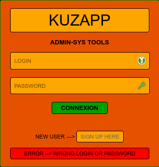
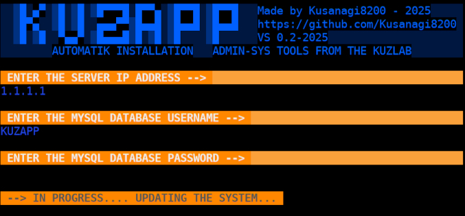

## KuzApp - BETA-0.2-2025 - LINUX SYSTEM ADMINISTRATION TOOLS

#### Apache (Web Host Version) + Apache (Docker Version) [KuzApp-Docker Branch](https://github.com/Kusanagi8200/KuzApp/tree/KuzApp-Docker)

_____________________________________________________________________________________________

#### **OVERVIEW**

**KuzApp is a web-based application designed to provide Linux system administration tools through a user-friendly interface.  
It allows users to execute various system administration scripts securely after logging in.  
The application is currently in Beta version 0.2-2025 and supports features like user registration, secure login, and script execution for system updates, network checks, and more.**

#### **FEATURES**

**User Authentication -->** Secure login and registration system with password hashing (SHA-256).

**System Administration Tools -->** Execute scripts for system updates, network checks, boot sequence analysis, and system information retrieval.

**Responsive Design -->** A visually appealing interface with a consistent theme using CSS styling.

**SSL Support -->** Runs on HTTPS with a self-signed certificate for secure communication.

#### **PREREQUISITES**

**Operating System -->** Ubuntu or Debian-based Linux distribution.

**Software -->** \
Apache2 web server \
PHP with MySQL support \
MySQL/MariaDB database \
OpenSSL for certificate generation

**Network -->** A static IP address (e.g., 192.168.124.187 as used in the configuration).

**Git -->** To clone the repository.

_____________________________________________________________________________________________

#### **INSTALLATION INSTRUCTIONS --> 2 WAYS**   

**1/** **SCRIPT INSTALL**

**AUTOMATIK-INSTALL IN PROGRESS** **--> https://github.com/Kusanagi8200/KuzApp/blob/main/kuzapp-auto-install.sh** \
**AUTOMATIK-UNINSTALL IN PROGRESS** **--> https://github.com/Kusanagi8200/KuzApp/blob/main/kuzapp-auto-uninstall.sh**

_____________________________________________________________________________________________

**2/ ADMIN-SYS INSTALL**

#### **STEP 1 --> Install Required Packages**

Run the following commands to install Apache2, PHP, and MySQL dependencies depends on your system

    sudo apt update
    sudo apt install apache2 php-mysql php-mysqli git php 
    sudo a2enmod ssl
    sudo a2enmod rewrite

Verify that the mysqli PHP module is enabled

    php -m | grep mysqli

_____________________________________________________________________________________________

#### **STEP 2 --> Clone the KuzApp Repository**

Clone the KuzApp repository from GitHub to the Apache web directory

    sudo git clone https://github.com/Kusanagi8200/KuzApp.git /var/www/html/KuzApp

**All necessary files are available in the repository --> https://github.com/Kusanagi8200/KuzApp/tree/main**

_____________________________________________________________________________________________

#### **STEP 3 --> Set Up MySQL Database**

Install MySQL/MariaDB and configure the database for KuzApp

    sudo apt install mariadb-server
    sudo mysql -u root -p

Create the database and user

    CREATE DATABASE registration;
    USE registration;

    CREATE TABLE users (
    id INT AUTO_INCREMENT PRIMARY KEY,
    username VARCHAR(255) NOT NULL,
    password VARCHAR(255) NOT NULL,
    email VARCHAR(255) NOT NULL,
    created_at TIMESTAMP DEFAULT CURRENT_TIMESTAMP
    );

    CREATE USER 'kuzapp_user'@'localhost' IDENTIFIED BY 'your_secure_password';
    GRANT ALL PRIVILEGES ON registration.* TO 'kuzapp_user'@'localhost';
    FLUSH PRIVILEGES;
    EXIT;

Replace kuzapp_user and your_secure_password with your desired username and password.

_____________________________________________________________________________________________

#### **STEP 4 --> Generate Self-Signed SSL Certificate**

Create directories for SSL certificates and generate a self-signed certificate

    sudo mkdir -p /etc/ssl/private /etc/ssl/certs

    sudo openssl req -x509 -nodes -days 365 -newkey rsa:2048 \
    -keyout /etc/ssl/private/kuzapp-selfsigned.key \
    -out /etc/ssl/certs/kuzapp-selfsigned.crt \
    -subj "/C=$COUNTRY/ST=$REGION/L=$CITY/O=KuzApp/OU=IT/CN=$IP"

Replace $IP with your server's IP address.

_____________________________________________________________________________________________

#### **STEP 5 --> Configure Apache Virtual Host**

Create a new Apache configuration file for KuzApp

    sudo nano /etc/apache2/sites-available/KuzApp.conf

Add the following configuration

    <VirtualHost *:8443>
    ServerName $IP
    DocumentRoot /var/www/html/KuzApp

    SSLEngine on
    SSLCertificateFile /etc/ssl/certs/kuzapp-selfsigned.crt
    SSLCertificateKeyFile /etc/ssl/private/kuzapp-selfsigned.key

    DirectoryIndex /KuzApp/login.php

    <Directory /var/www/html/KuzApp>
        Require all granted
        AllowOverride All
        Options FollowSymLinks MultiViews
    </Directory>
    </VirtualHost>

Enable the site and restart Apache

    sudo a2ensite KuzApp.conf
    sudo systemctl restart apache2

_____________________________________________________________________________________________

#### **STEP 6 --> Set Up File Permissions**

Set the correct ownership and permissions for the KuzApp directory

    sudo chown -R www-data:www-data /var/www/html/KuzApp
    sudo chmod -R 755 /var/www/html/KuzApp

_____________________________________________________________________________________________

#### **STEP 7 --> Configure Database Connection**

Create or edit the config.php file in /var/www/html/KuzApp with the correct database credentials

    <?php
    $host = "localhost";
    $username = "kuzapp_user";
    $password = "your_secure_password";
    $dbname = "registration";

    $conn = mysqli_connect($host, $username, $password, $dbname);

    if (!$conn) {
    die("Connection failed: " . mysqli_connect_error());
    }
    ?>

_____________________________________________________________________________________________

#### **STEP 8 --> Verify Background Image**

The background image (KuzApp-Fond.jpg) is included in the repository and should be located in /var/www/html/KuzApp.   
This image is referenced in the CSS for the application’s background.

_____________________________________________________________________________________________

#### **STEP 9 --> Test the Application**

Open a web browser and navigate to --> https://$IP:8443/KuzApp/login.php

You may need to accept the self-signed certificate warning in your browser.

_____________________________________________________________________________________________

#### **USAGE INSTRUCTIONS**

#### **1. Register a New User**

Navigate to the registration page via the "SIGN UP HERE" link on the login page.
Enter a username, email, and password, then click "ACTIVATE" to create an account.
The password is hashed using SHA-256 before being stored in the database.

#### **2. Log In**

On the login page, enter your username and password.
If credentials are correct, you will be redirected to app.php, the main dashboard.

#### **3. Use System Administration Tools**

The dashboard (app.php) displays a list of buttons for various scripts (e.g., UPDATE-SCRIPT, CHECK-NETWORK).
Click a button to execute the corresponding script (via POST requests to respective PHP files).
Additional buttons (1–9) allow viewing the script contents in text format before execution.

#### **4. Log Out**

Click the "LOG OUT" link in the bottom banner to return to the login page.

_____________________________________________________________________________________________

#### **SECURITY NOTES**

Self-Signed Certificate: The application uses a self-signed SSL certificate, which may trigger browser warnings. For production, consider using a certificate from a trusted Certificate Authority.
Password Hashing: Passwords are hashed using SHA-256, but consider upgrading to stronger hashing algorithms like bcrypt in production.
Input Sanitization: The application uses mysqli_real_escape_string to prevent SQL injection. Ensure all inputs are validated and sanitized.
File Permissions: The /var/www/html/KuzApp directory is owned by www-data with 755 permissions to ensure security.

#### **TROUBLESHOOTING**

Apache Errors: Check Apache logs at /var/log/apache2/error.log for issues.
Database Connection Issues: Verify config.php credentials and ensure MySQL is running (sudo systemctl status mysql).
SSL Issues: Ensure the certificate paths in KuzApp.conf are correct and the SSL module is enabled.
Script Execution: Ensure the PHP files for scripts (e.g., update-script.php) exist in the repository and are executable.

#### **FUTUR IMPROVEMENTS**

Implement stronger password hashing (e.g., bcrypt).
Add input validation for registration and login forms.
Support for multi-user roles (e.g., admin vs. regular user).
Replace self-signed certificate with a trusted one.
Add logging for script execution and user actions.

### **LICENCE**
This project is for educational purposes and is not licensed for commercial use.

_____________________________________________________________________________________________  
