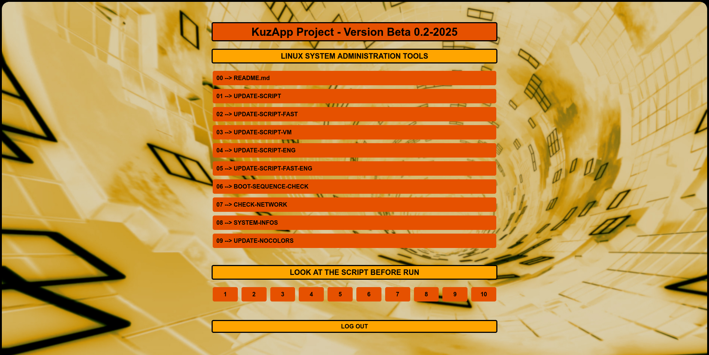

## KuzApp Version Beta - Linux System Administration Tools

## Apache Server Version On Premisce

### Apache Server Docker Version on [KuzApp-Docker Branch](https://github.com/Kusanagi8200/KuzApp/tree/KuzApp-Docker)

## System Maintenance Information and Diagnostic Script
The bash script provides an interface to execute a variety of sub-scripts that perform system cleaning, diagnostic, and network information tasks.

## Features
The script displays a menu with several options, each corresponding to a different sub-script :

  + 01 **UPDATE-SCRIPT**: Update the system.
  + 02 **UPDATE-SCRIPT-FAST**: Quick system update.
  + 03 **UPDATE-SCRIPT-VM**: Update specifically for virtual machines.
  + 04 **UPDATE-SCRIPT-ENG**: English version of the Update script.
  + 05 **UPDATE-SCRIPT-FAST-ENG**: English version of the quick Update script.
  + 06 **BOOT-SEQUENCE-CHECK**: Checks the boot sequence.
  + 07 **CHECK-NETWORK**: Diagnoses network problems.
  + 08 **HARDWARE-INFOS**: Displays hardware information.
  + 09 **SYSTEM-INFOS**: Displays system information.
  + 10 **UPDATE-SCRIPT**: No colors Update script.

## License
The script is distributed under the GNU General Public License, version 3 or later.

